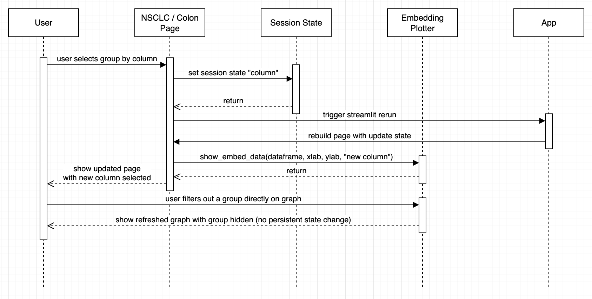
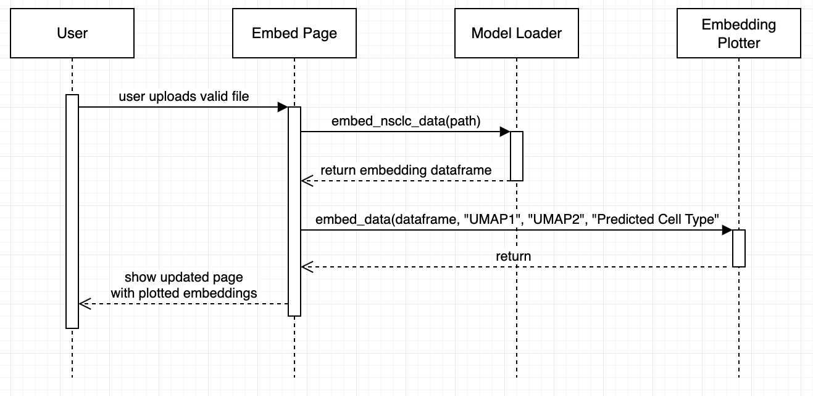
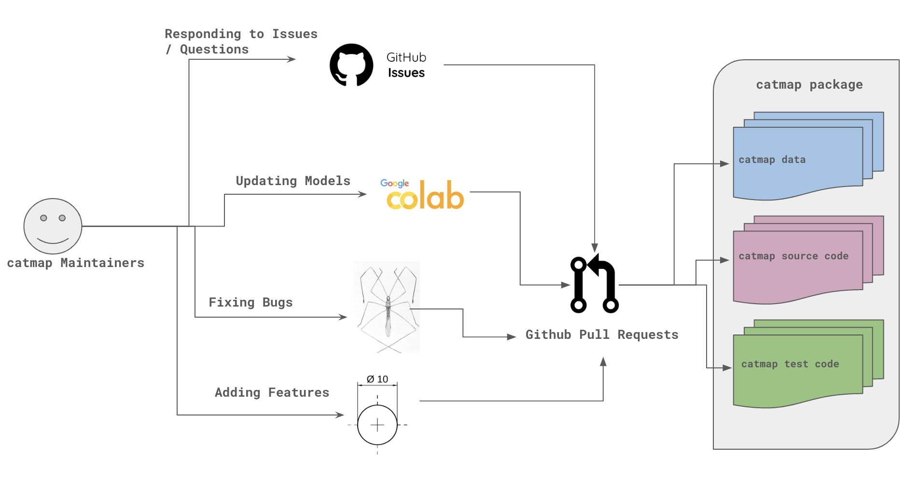

# Software Components

`catmap` is implemented with a mix of ui code for the [streamlit framework](https://streamlit.io/) as well as bioinformatics tools used to process single cell data, namely [scvi](https://scvi-tools.org/). As such there are a mix of data processing, machine learning, and UI components. This document highlights the most significant components and their relation to one another.

# IO

These components relate to loading files and machine learning models.

## Model Loader

This component is responsible for loading pretrained models, opening new single cell transcriptomic data, and wraps the commands needed to create embeddings of the new data. For now it can only predict the cell types though we imagine it could be extended to predict arbitrary labels of the cells given the right training data and machine learning model.

### Input

To load new data / process it's embeddings this component takes in a path.

### Output

This component is only externally called to create new embeddings and the loading of the models is done lazily. The output is a pandas dataframe with the columns `UMAP1`, `UMAP2`, and `Predicted Cell Type`.

### Assumptions

This module depends on machine learning dependencies which can be fragile (i.e. dependent on hardware / os). This module also relies on the input files existing and being the right format / preprocessing. There is a basic check to assert the file exists within the component.

# Pages

These UI components hold the streamlit logic which build onto an existing streamlit container. Pages as opposed to page components are a more organizational tool which reuse different page components to show visualizations.

## NSCLC Page (aka Page 1)

This component has the logic to build a page for visualizing NSCLC data as well as some specific descriptive writing pertaining to the dataset.

### Input

This pages hold components which themselves take input through user interactions. It doesn't take any input other than the parent streamlit container to build onto.

### Output

The page builds it's subcomponents onto the parent streamlit container.

### Assumptions

The page assumes that the streamlit session_state has the needed keys to pass into it's subcomponents (e.g. the names of the columns).

## Embedding Page

This page is a specialized page to hold the logic of embedding a new file. It has two states. One if the file is uploaded to show the embedding result and the other to prompt the user to embed new data and display error messages about it.

### Input

This pages hold components which themselves take input through user interactions. It doesn't take any input other than the parent streamlit container to build onto.

### Output

The page builds it's subcomponents onto the parent streamlit container.

### Assumptions

The page doesn't read from the streamlit session state. It does assume however that it can store a temporary file when the user uploads a file.

# Page Components

These are the page subcomponents which display information and provide inputs for the user to interact with.

## Navigation Buttons

These buttons are streamlit buttons which bring the user to a particular page. These include the return to home and go to page buttons.

### Input

These buttons take user clicks as input.

### Output

Depending on the user click, the button will store the desired page into the streamlit session state.

### Assumptions

These buttons don't call into other functions beyond setting the page state. Therefore they rely on the app to switch between pages when the page state changes.

## Embedding Plotter

This is the visual core of `catmap`. It displays embedded coordinates of hundreds of thousands of cells and overlays metadata onto the cells (e.g. the stage of cancer of the patient they were collected from). It can be configured to adapt to the input dataset and is used to visualize both the datasets and the embedding screen.

### Input

The embedding plotter takes a variety of user inputs including zooming, panning, setting the bounds of the visual, screenshotting, and toggling groups.

In code, the embedding plotter takes in a pandas dataframe and the names of the x and y coordinate columns. Finally it accepts the name of the column to use for coloring the data.

### Output

The embedding plotter should react to the user action and update it's visualization dynamically.

### Assumptions

We assume that the user's computer is fast enough to run show the hundreds of thousands of plotted points as once. We also assume the passed in data has the rows and columns accurately compared to what was passed in to the component.

# State Components

## Session State

We use the built in streamlit session state to store the state of the application (e.g. what columns are selected, what page we are on) as well as store the preprocessed datasets.

### Input

This component takes a key of state to store (e.g. column_names).

### Output

For the given key, this component returns the desired value for the downstream components to use.

### Assumptions

This component does not provide any verification of the state and relies on it's client components to manage the state keys and values. Furthermore it relies on the App component to set all the initial state.

# App Components

## App

This component is the streamlit script which runs the application. It's main responsibilities are to initialize the state and load the preprocessed data and then display the correct pages depending on the current page state.

### Input

This component reacts to the page state to display the correct page.

### Output

This component builds the correct page and initializes all the application state including loading the initial datasets.

### Assumptions

We assume that the pages correctly implement their build function and manage the state correctly after the initialization.

## **Additional Components:**
* Select column dropdown - A page component used to select the desired column to color and group the plotted data by.
* Info button - A UI component which displays information on how to interact with the visualization.
* Launcher - A component which launches the streamlit app.

# Interactions

## Embed Flow
This diagram shows the flow for how the column selection and filtering toggles would change the visualization for the use case of visualizing cancer data.

## Visualize / Change Filters Flow
This diagram shows how new data would be embedded for both the use case of a doctor embedding patient data and the patient viewing that data with their doctor.

## Maintainer Flow
This diagram shows at a high level what components are needed to maintian and extend the app for the maintainer use case.

TODO add this picture
<!--  -->
