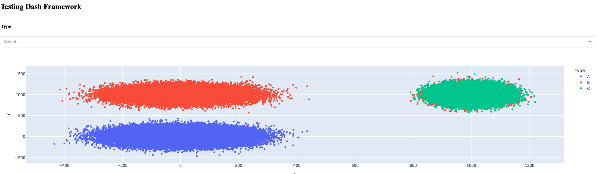
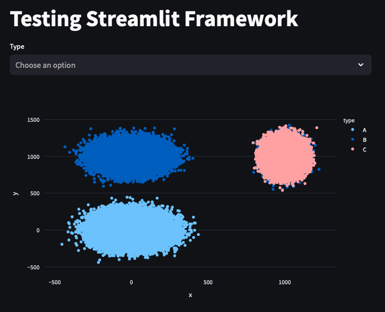

# Background
The goal of our project is to produce an application that presents a visualization of cancer transcriptomes and allows dynamic labels and filters to be applied. In order to create this app, we need a python library that allows for highly detailed and dynamic visualizations that can handle hundreds of thousands of data points at a time. This technology relates to multiple use cases for our project, including interacting with filters and viewing/analyzing the mapped coordinates that are created by the machine learning model.

# Description of Libraries
We compared two python frameworks that could potentially address our technology requirement:  (Dash) and  (Streamlit). 

### <ins>**Dash Overview**</ins> 
Dash was created by Plotly which was founded by Alex Johnson, Jack Parmer, Chris Parmer, and Matthew Sundquist. Dash is a production python framework for building web applications. It is built on top of Flask, Plotly.js, and React.js. It is generally intended for enterprise use and is equipped to handle high traffic. It also allows for a lot of customization but has a relatively steep learning curve and may require extensive knowledge of CSS and HTML in order to achive the desired level of customization. 

### <ins>**Streamlit Overview**</ins> 
Streamlit was founded by Adrien Treuille, Amanda Kelly, and Thiago Teixeira. Streamlit is an open-source python framework for building web applications. It is desgined for data scientists who want a fast way to display and share their data, but is not as equipped to handle high traffic. It also allows for less customization than Dash, but makes up for this in its ease of use. It does not require much additional coding expertise beyond basic python.

# Comparison of Technologies
The biggest trade off between Dash and Streamlit is customizability versus ease of use. Dash was built more for long-term use for companies that want to support lots of traffic to their web application and who want to have the ability to tailor the web app to their specific customization needs. Streamlit was built to enable fast and efficient web app creation and sharing with less customization and less ability to handle high traffic/large amounts of data. Both applications seems to have a relatively large user base and therefore should have a good community/support network for any issues we may run into. 

In order to further compare the two frameworks, we created a simple web app with each of them in which we displayed a scatterplot with 300,000 points and a multiselect filter option. Each of these were created without any special customizations.

### Dash Results:

### Streamlit Results:

### Considerations:
Dash took over twice as many lines of code to produce the same results in a default format that we found to be less visually appealing. It also required knowledge of how to incorporate callbacks in order to use the multiselect filter appropriately. On the other hand, Streamlit required no new coding knowledge other than understanding a couple of its functions. Overall, it was much simpler to use and resulted in a visually appealing application without needing any UI customizations. 

# Final Choice
In the end, given that we have only a few weeks to complete this project and do not plan to have high levels of traffic on the web app or need high levels of customization, we decided that Streamlit better fit our needs. Streamlit is able to efficiently handle the amount of data that we have and has a clean finish with little customization or additional coding knowledge required. This will allow us to spend less time working through the steep learning curve of Dash and instead devote more resources on the other aspects of the project outside of UI. 

# Drawbacks/Concerns
At this stage in our development, one concern we have is that we may run into an aspect of the application/visualization that we would like to customize more, but will be unable to do so with Streamlit's limited customization options. However, we hope that we will be able to creatively work around these possibie limitations since we are the main stakeholders of the project and do not have to meet the specific needs of external customers. Another possible drawback is that Streamlit may update/display data a bit slower than Dash. We were able to test the plotting speed with the same number of data points (>200,000) that we expect to have in the final plot and didn't have any runtime issues there, but we don't know for sure how it will work with our true dataset yet. 

# Streamlit Demo Screen Video

https://drive.google.com/file/d/12EuSR_X1wtvmjDqVJwNmXnx3jofNzHKo/view?usp=drive_link

