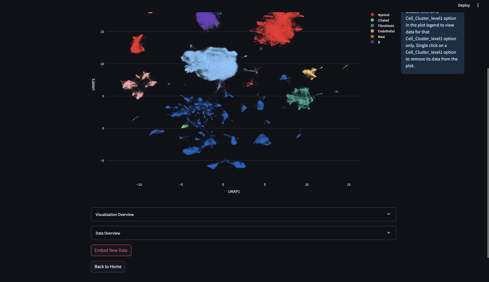
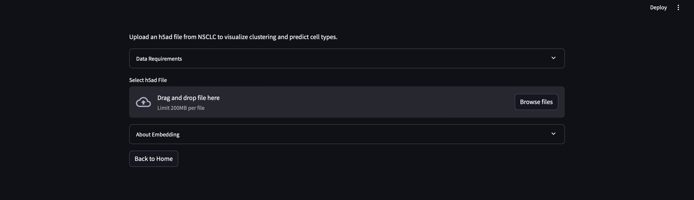
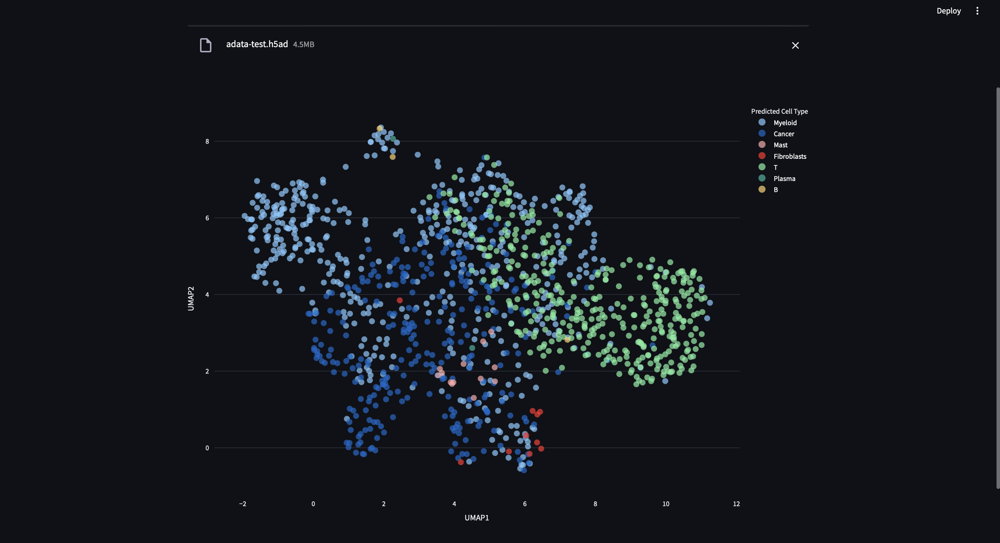
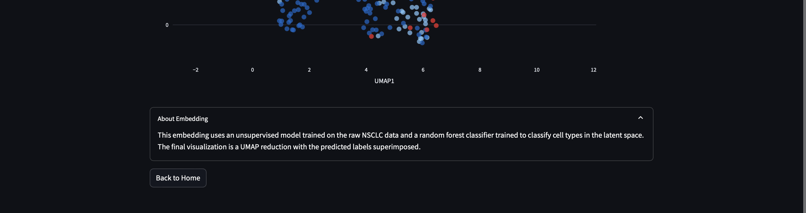

# Embedding New Patient Data

Catmap can be used to embed transcriptomic data collected from Non-Small-Cell-Lung Cancer (NSCLC) patients. Catmap has limited ability to preprocess new patient data. We recommend using [seurat](https://satijalab.org/seurat/) to preprocess your data. Ultimately it will need to be processed in the following fashion:

1. Select for the 2000 genes catmap is trained on. These genes can be loaded from the variable names of the adata_test.h5ad available in the `catmap/tests/data/` subdirectory. Export a h5ad / anndata file with the X as the raw gene counts for these genes.

2. Then in the catmap UI go to the NSCLC page and click Embed New Data and follow the prompts to upload your patient data. You can use the data available in `catmap/tests/data` to test this. The results should appear as below.

See the section on "Interacting with Catmaps" to find how to get the to "Embed New Data" option. Here is a screenshot of its location on the NSCLC page:

After clicking the "Embed New Data" button, you will be taken to the following page: 

Upload your data here and wait for the logic to run.

After the emebedding logic runs, catmap will show a plot of the embedded UMAP coordinates colored by the predicted cell types for the uploaded sample. Here is an example with our sample data:

Finally, if you scroll to the bottom of the page you will see a text dropdown with more information about the embedding as well as an option to return to the home page. 

# Interpreting the Embedding Results

Three steps happen during the embedding process.

1. A trained model embeds the new data using its learned embedding trained from our reference dataset.
2. A random forest classifier predicts the cell types of the new cells.
3. A UMAP reduction is calculated for the newly embedded points.

Note that the UMAP reduction does not correspond to the reference NSCLC page’s UMAP coordinates since it focuses only on the newly uploaded data.

Also note that the ratio of classified points depends on the method of collection of the tissue samples and specifically the ratio of tissue types collected.