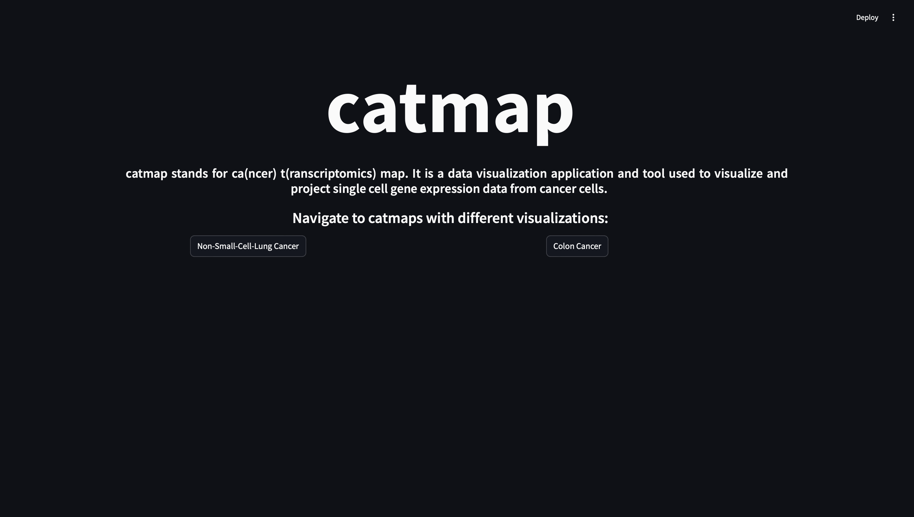
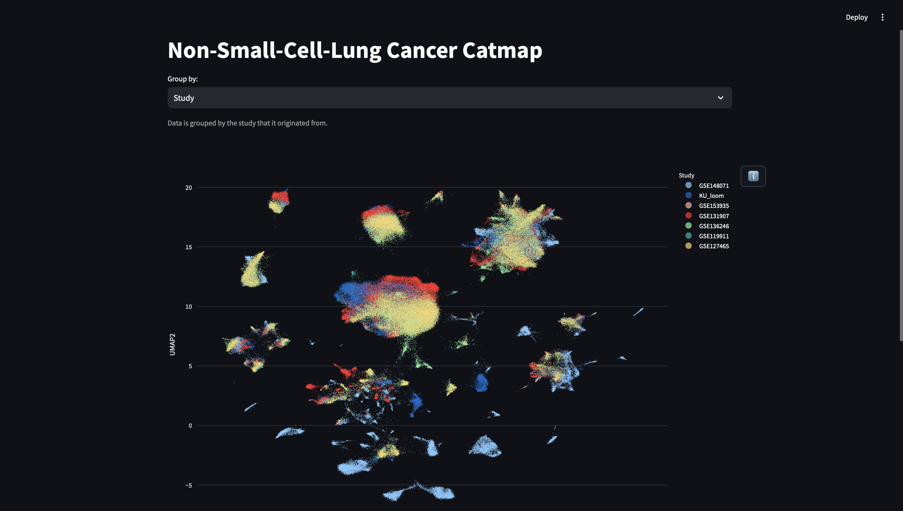
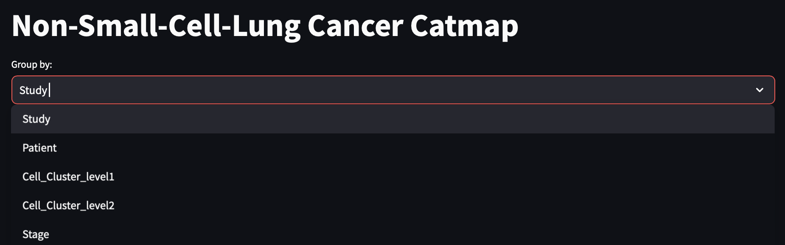
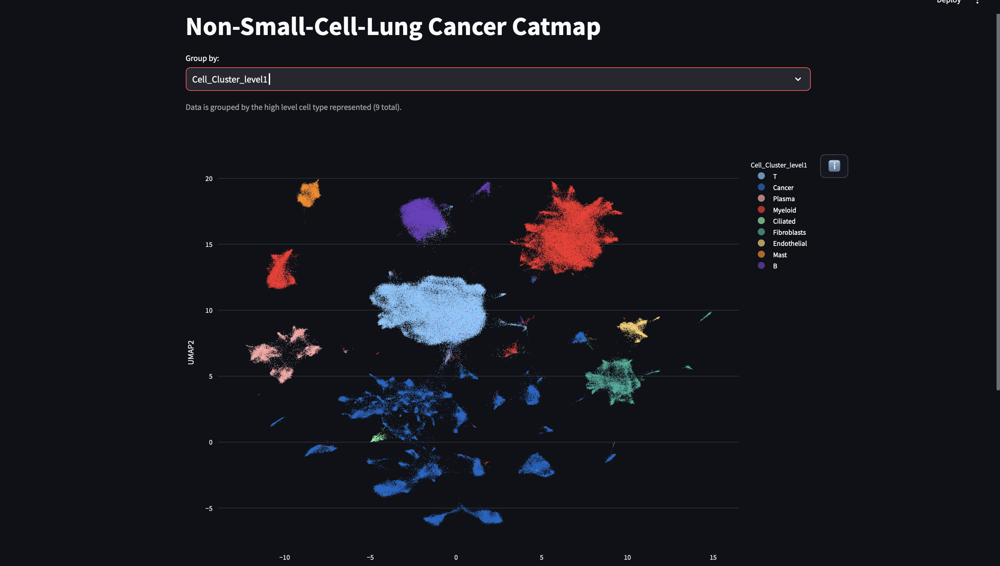
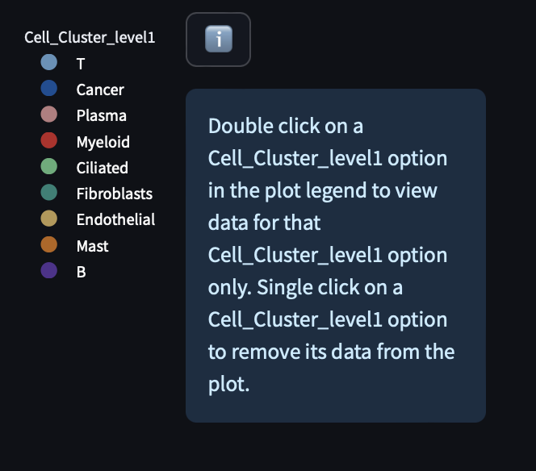
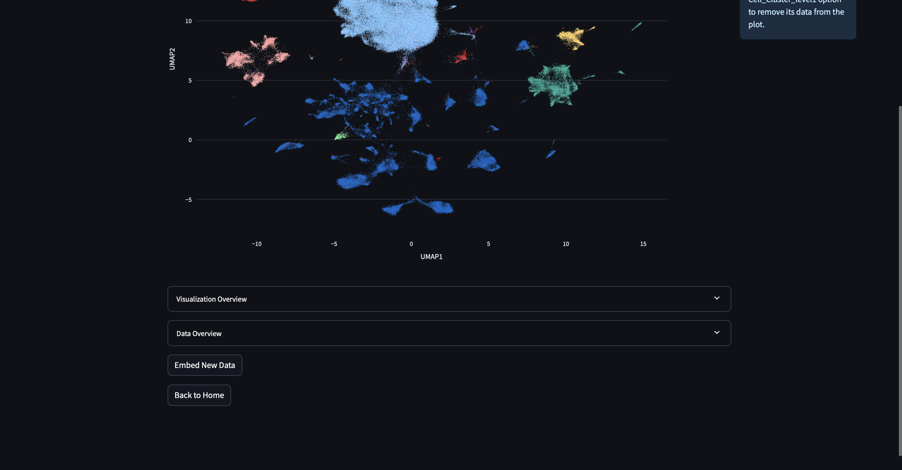
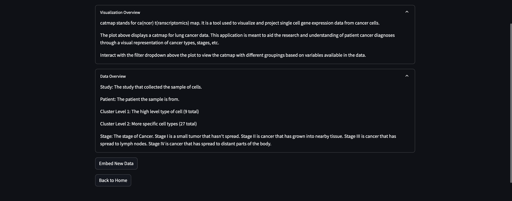

# Interacting with catmaps

To open the cancer dataset visualizations (assuming catmap is correctly installed):

First launch catmap from the command line with

```
catmap
```

You will be taken the a web application with the following home screen:



Click on the Non-Small-Cell-Lung Cancer button to navigate to a new page with the following visualization for the Lung Cancer dataset:



You can select various options in the dropdown at the top to view the data with different groupings. 



If we select Cell_Cluster_level1, we see that the catmap updates as follows:



There is also an info button on the far right that provides more information about how to iteract with the visualization:



If you scroll down, you'll see that there are a few more buttons to inteact with at the bottom of the page.



You can click on the "Visualization Overview" or "Data Overview" dropdowns to learn more about the catmap.



There is also an option to "Embed New Data", but this is only relevant to some users, so it will be explained in another section. 

Finally, you can click "Back to Home" to return to the home page.


Back at the home page you can then select the second option, "Colon Cancer" to go through the same steps above for a new dataset. 

# Interpreting Visualizations

For the visualizations, you will see visual embeddings of the top expressed genes in our training datasets. More details about the machine learning algorithms and preprocessing are available in the README, but some general takeaways are:

1. The embeddings were trained on raw counts data using an unsupervised approach.
2. As a rough rule of thumb, the distances of the embeddings tend to be more significant when the points are close compared to when they are further. Do not rely on larger distances (> 20% of the total embedding volume) to mean any significance. This is because while the final embedding is in two dimensions, the machine learning algorithm operates in higher dimensional space.
3. The known labels of the cells (e.g. the patient they come from) are projected onto the points after training.

